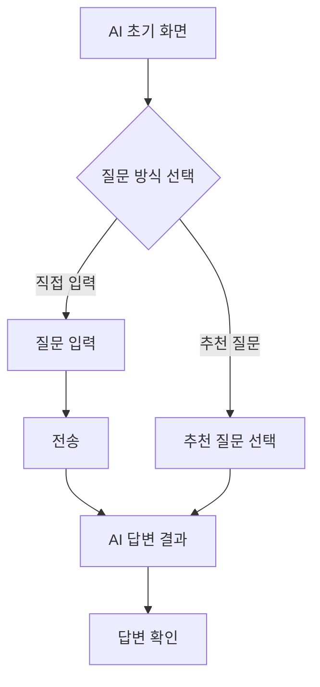
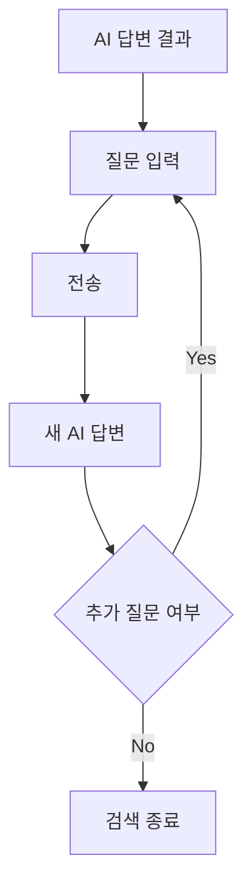
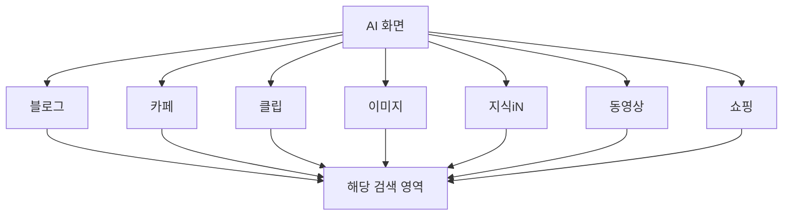

# NAVER AI 검색 IA & User Flow

## 1. IA
```
NAVER AI 검색
│
├── Global Navigation
│   ├── NAVER 로고
│   ├── 새 대화
│   ├── 대화 기록
│   └── 설정
│
├── AI 검색
│   │
│   ├── 초기 화면
│   │   ├── 환영/서비스 소개
│   │   │   └── "더욱 풍부해진 답변을 만나보세요"
│   │   │
│   │   ├── 질문 입력 영역
│   │   │   ├── 입력창
│   │   │   └── 전송 버튼
│   │   │
│   │   └── 추천 질문
│   │       ├── 추천 질문 01
│   │       ├── 추천 질문 02
│   │       └── 추천 질문 03
│   │
│   └── 답변 결과 화면
│       │
│       ├── Search Navigation
│       │   ├── AI
│       │   ├── 블로그
│       │   ├── 카페
│       │   ├── 클립
│       │   ├── 이미지
│       │   ├── 지식iN
│       │   ├── 동영상
│       │   ├── 쇼핑
│       │   └── 더보기 (...)
│       │
│       ├── 사용자 질문
│       │
│       ├── AI 답변
│       │   ├── 자연어 답변
│       │   └── 구조화 콘텐츠
│       │       └── 표
│       │
│       ├── 출처
│       │   ├── 뉴스/기사
│       │   ├── 블로그
│       │   └── 네이버 인플루언서
│       │
│       ├── 관련 검색어
│       │   └── 관련 검색어 목록
│       │
│       └── 후속 질문 입력
│
└── Footer
    ├── AI 답변 정확성 안내
    ├── 개인정보처리방침
    └── 고객센터
```
------------------------------------------------------------------------

## 2. User Flow

### 2.1 신규 검색



### 2.2 후속 질문



### 2.3 검색 서비스 이동

